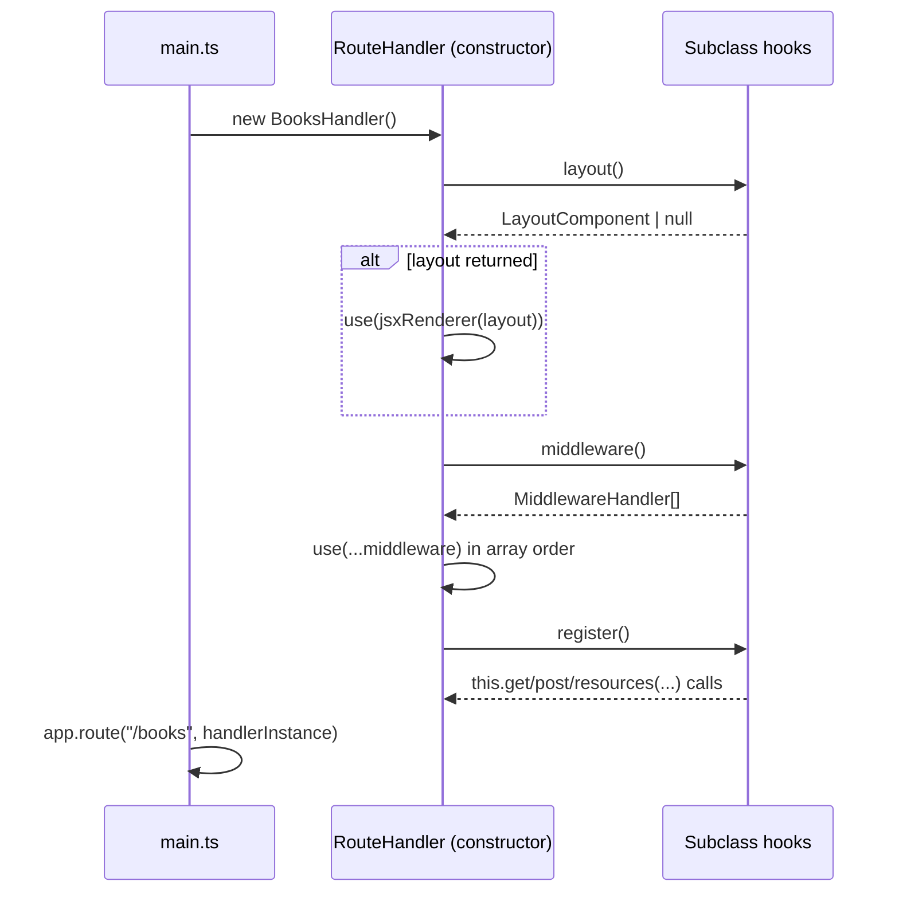

# Concepts

This page goes deeper than the [README](../README.md)'s four design
principles — it explains *why* each choice was made, how requests flow
through a `RouteHandler`, and how dependency injection works without a
provider container. If you just want to write your first route, start with
[Getting started](./getting-started.md).

## Design principles, in depth

### 1. A thin wrapper over Hono

oven does not reimplement routing, middleware composition, or the request/
response model — it leans on Hono's own primitives (`jsx-renderer`, cookie
helpers, `languageDetector`, etc.) wherever they already do the job. The one
deliberate replacement is CSRF protection: Hono's built-in CSRF middleware
checks the `Origin` header, which doesn't cover same-origin-but-cross-page
attacks or non-browser clients consistently; oven's `Csrf` (in
`@tknf/oven/security`) uses token-based verification instead. Every other
surface — routing, rendering, middleware — is Hono, unmodified. This keeps
the framework's surface area small and means Hono's own documentation and
ecosystem apply directly to an oven app.

### 2. One idiom: the class

Every stateful concept in oven — `RouteHandler`, `Model`, `Session`,
`Storage`, `Mailer`, `ContextAccessor` — is expressed the same way: an
abstract base class that wires up shared behavior in its constructor or
shared methods, plus a concrete subclass that only implements the
few methods specific to it. There is exactly one idiom to learn, and it
composes with plain OOP inheritance (a `BooksHandler` can extend an
`AdminHandler` that extends `RouteHandler`, layering shared `layout()`/
`middleware()` along the way — see [Request lifecycle](#request-lifecycle)
below). This was chosen over alternatives such as file-based routing,
`defineHandler()` + glob discovery, or a hook/lifecycle-callback system,
specifically because those approaches introduce a second implicit
vocabulary (directory conventions, discovery order, hook names) on top of
what the language already gives you for free through classes.

### 3. Backend-agnostic

None of oven's core modules import a Cloudflare binding type or call a
platform-specific API directly. Instead, the core depends only on small
abstractions — `KeyValueStore` (`@tknf/oven/kv`), `Storage`
(`@tknf/oven/storage`), `Broadcaster` (`@tknf/oven/realtime`), `JobQueue`
(`@tknf/oven/jobs`), and so on. Cloudflare KV, R2, and Queues are
*one* adapter implementing these abstractions, shipped separately behind
`@tknf/oven/cloudflare` so that importing the core package never pulls in
`@cloudflare/workers-types` as a hard dependency. The same abstractions have
adapters for Node-friendly backends (in-memory, SQL-backed, Upstash Redis,
etc.), so an app can move between Cloudflare Workers and a traditional Node
server without rewriting application code — only the adapter wiring changes.

### 4. No magic

oven deliberately has no file-based routing, no `defineHandler()` + glob
auto-discovery, no two-phase named-slot templating, no
provider/DI container, and no lifecycle-hook system (`onMount`,
`beforeRender`, etc.). Every route, every middleware, and every wired-up
service is an explicit line of code: a `register()` method, an
`app.route()` call, an `app.use(someAccessor.register)` call. This is a
direct consequence of principle 2 — once classes and constructors are the
one idiom, "magic" wiring mechanisms are actively redundant, and their
absence means `grep`-ing for a symbol always finds every place it's used.

## Request lifecycle

A `RouteHandler` subclass wires itself up inside its own constructor, in a
fixed order: `layout()` → `middleware()` → `register()`. Because this
happens in the base class's constructor, the three hooks must be written as
methods (or getters), not class fields — a class field on a subclass is only
assigned *after* `super()` returns, which is too late for the base
constructor to see it.



A few consequences fall out of this fixed order:

- Middleware registered in `middleware()` always runs *after* the renderer
  from `layout()` is applied, so it can assume `c.render` is already
  available.
- Because `register()` runs last, routes declared there can rely on
  anything set up by earlier middleware (session, CSRF token, auth guard,
  etc.).
- Inheriting a namespace-level base class (e.g. an `AdminHandler` that
  implements `layout()`/`middleware()` once) and calling
  `super.middleware()` from a subclass composes the middleware chains in
  declaration order — this is the mechanism intended for grouping routes
  under a shared layout/auth policy without introducing a separate grouping
  API.
- `app.route(prefix, handlerInstance)` is plain Hono; `RouteHandler` adds no
  mounting API of its own; the mounting line in `main.ts` is the only place
  route trees get assembled.

## Dependency injection

Rather than a provider/service-locator container, oven expresses "make a
value available to every handler downstream" as a `register`/`use` function
pair, implemented by the `ContextAccessor` abstract base class
(`@tknf/oven/routing`):

- `register` is a Hono middleware (a class-field arrow function) that
  computes a value and calls `c.set(key, value)`.
- `use(c)` reads the value back with `c.get(key)` and throws an error naming
  the key if it was never registered on that request's route — so a missing
  `app.use(someAccessor.register)` fails loudly and specifically, instead of
  producing a silent `undefined`.

`register` and `use` are class fields (arrow functions), not prototype
methods, precisely so they can be detached from their instance and passed
by reference — `app.use(accessor.register)` and
`options.session: sessionAccessor.use` both rely on this. A prototype method
extracted the same way would lose its `this` binding.

Most services don't need a bespoke accessor subclass: `ScopedValueAccessor`
already covers "create a value, optionally memoize it across requests"
(`scope: "request"` recomputes the value on every request, right for
anything derived from per-request state such as bindings or credentials
handed to each invocation; `scope: "app"` memoizes the first result for the
process's lifetime, right for values that are safe and expensive to build
once, such as a connection pool). The convention is for the app's own
wiring module (e.g. `src/lib/db.ts`) to construct one `ScopedValueAccessor`
instance privately and export only the `register`/`use` pair:

```ts
// src/lib/db.ts
import { ScopedValueAccessor } from "@tknf/oven/routing";
import { drizzle } from "drizzle-orm/libsql";

type AppBindings = { DATABASE_URL: string };
type AppEnv = { Bindings: AppBindings; Variables: { db?: ReturnType<typeof drizzle> } };

const accessor = new ScopedValueAccessor<AppEnv, "db">("db", {
  create: (c) => drizzle(c.env.DATABASE_URL),
});

export const registerDatabase = accessor.register;
export const useDatabase = accessor.use;
```

```ts
// main.ts
app.use(registerDatabase);
```

```ts
// inside a handler's register()
this.get("/", (c) => {
  const db = useDatabase(c);
  // ...
});
```

A provider container (something that resolves dependencies by token or by
constructor-parameter reflection) was considered and rejected: it adds a
second, implicit wiring mechanism on top of the one idiom from principle 2,
and TypeScript's structural type system already gives `register`/`use`
pairs full type safety without any token registry.

## Subpath export reference

`@tknf/oven`'s root export (`.`) aggregates the application-facing modules;
platform adapters (`cloudflare`, `node`) and the test harness (`test`) are
deliberately excluded from it and must be imported from their own subpath.

| Subpath | Provides |
| --- | --- |
| `@tknf/oven` | Aggregate re-export of the modules below (excludes `cloudflare`, `node`, `test`) |
| `@tknf/oven/admin` | `AdminPanel`/`AdminResource` — an admin CRUD surface built on the same routing conventions |
| `@tknf/oven/audit` | Audit log recording (e.g. `PgAuditLog` and other backend adapters) |
| `@tknf/oven/auth` | `Guard`, `Policy`, `ApiToken`, `OAuthClient`, `PasswordReset`, `EmailVerification`, `RememberToken` |
| `@tknf/oven/cache` | `Cache` and `CacheControl` response-caching helpers |
| `@tknf/oven/database` | `DatabaseAccessor` — the dedicated `ContextAccessor` for wiring a Drizzle database |
| `@tknf/oven/datasource` | `Datasource`/`RestDatasource` — a thin base over `fetch` for external HTTP/REST sources, with Standard Schema response validation |
| `@tknf/oven/form` | `Form`/`FormBinding` — Standard Schema-based form validation |
| `@tknf/oven/helpers` | Assorted small utility helpers |
| `@tknf/oven/i18n` | `Translator` and locale catalog helpers |
| `@tknf/oven/jobs` | `Job`, `JobQueue`, `JobRegistry`, and backend-specific queue implementations |
| `@tknf/oven/kv` | `KeyValueStore` abstraction, in-memory/DB/Upstash Redis adapters, `FeatureFlags` |
| `@tknf/oven/logging` | `Logger`, `ConsoleLogger`, `NullLogger` |
| `@tknf/oven/mailer` | `Mailer`, `ConsoleMailer`, `FetchMailer`, `MailTemplate`, `DeliverMailJob`, `MailPreviewHandler` |
| `@tknf/oven/model` | `SQLiteModel`, `PgModel`, `MySqlModel`, `StaleRecordError` — a thin base over Drizzle |
| `@tknf/oven/pagination` | Pagination helpers for query results |
| `@tknf/oven/realtime` | `Broadcaster`, backend adapters, `WebSocketHandler`, `ChannelAuthorizer` |
| `@tknf/oven/routing` | `RouteHandler`, `ContextAccessor`, `ValueAccessor`, `ScopedValueAccessor` |
| `@tknf/oven/security` | `Csrf`, `SecureHeaders`, `RateLimiter`, `TrustedHost`, `Encrypter`, `UrlSigner`, `MaintenanceMode` |
| `@tknf/oven/session` | `Session`, `SessionStorage`, `CookieSessionStorage`, `KeyValueSessionStorage`, and backend adapters |
| `@tknf/oven/storage` | `Storage` abstraction, `S3Storage`, `GoogleCloudStorage`, `InMemoryStorage`, `S3UrlSigner` |
| `@tknf/oven/support` | `IdGenerator` variants, `CookieAccessor` |
| `@tknf/oven/view` | `LayoutComponent`, `LayoutProps`, and other layout/rendering types |
| `@tknf/oven/vite` | Vite build/dev integration |
| `@tknf/oven/cloudflare` | Cloudflare Workers-specific adapters (KV, R2, Cache, Queues, Cron Triggers) |
| `@tknf/oven/node` | Node-specific adapters (`FileKeyValueStore`, `FileStorage`) |
| `@tknf/oven/test` | Test harness for exercising oven apps in `.test.ts` files |

## Class-based idiom

A handful of constraints fall directly out of subclassing `Hono` and
building the register/use pattern on class fields. They're worth knowing
before you hit them:

- **Reserved names.** `RouteHandler` extends `Hono` directly, so any name
  Hono itself uses as an instance field or method (`get`, `post`, `put`,
  `delete`, `patch`, `options`, `all`, `on`, `use`, `router`, `getPath`,
  `routes`, `fetch`, `request`, `route`, `basePath`, `mount`, `notFound`,
  `onError`, etc.) cannot be reused as a subclass hook or field name.
  `routes` in particular is Hono's own route registry field
  (`routes = []`); shadowing it with a same-named subclass method produces
  `this.routes is not a function` once `super()` runs.
- **Hooks must be methods, not class fields.** `layout()`, `middleware()`,
  and `ContextAccessor#handle()` are all invoked from code that runs inside
  the *base* class's constructor. A subclass's own class-field
  initializers run only *after* `super()` returns, so a class field like
  `layout = MyLayout` would still be `undefined` at the point the base
  constructor reads it. Write these as ordinary methods
  (`protected layout() { return MyLayout; }`) instead.
- **`register`/`use` are the deliberate exception.** Unlike the hooks above,
  `ContextAccessor#register` and `#use` *are* class fields (arrow
  functions) — because they're meant to be detached from their instance and
  passed by reference (`app.use(accessor.register)`). A prototype method
  extracted the same way (`const fn = accessor.register`) would lose its
  `this` binding; an arrow-function field captures it permanently at
  construction time.
- **The Hono RPC client (`hc`) type chain is not preserved** across
  `RouteHandler` subclassing. This is an accepted tradeoff — oven targets
  server-rendered apps (Hono/JSX SSR + Turbo/Stimulus), where the `hc`
  client isn't part of the workflow to begin with.
