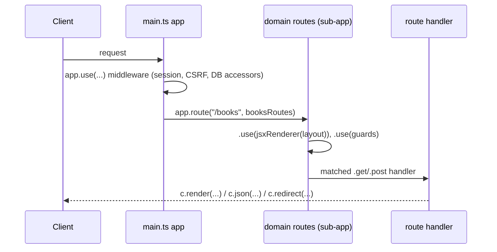

# Concepts

This page goes deeper than the [README](../README.md)'s four design
principles — it explains *why* each choice was made, how requests flow
through an app's route modules, and how dependency injection works without a
provider container. If you just want to write your first route, start with
[Getting started](./getting-started.md).

For application architecture, start with oven's standard capabilities and
extension points, then use Hono and custom code only for unmet requirements.
This preserves Hono's documented integration boundaries. See
[Application structure](./getting-started.md#application-structure) for the
canonical layout, instruction precedence, and evidence needed for deviations.

## Design principles, in depth

### 1. A thin wrapper over Hono

oven does not reimplement routing, middleware composition, or the request/
response model — it leans on Hono's own primitives (`jsx-renderer`, cookie
helpers, `languageDetector`, etc.) wherever they already do the job. The one
deliberate replacement is CSRF protection: Hono's built-in CSRF middleware
checks the `Origin` header, which doesn't cover same-origin-but-cross-page
attacks or non-browser clients consistently; oven's `Csrf` (in
`@tknf/oven/security`) uses token-based verification instead. Every other
surface — routing, rendering, middleware — is Hono, unmodified. This keeps
the framework's surface area small and means Hono's own documentation and
ecosystem apply directly to an oven app.

### 2. Classes for behavior, plain Hono apps for routes

Every stateful concept in oven — `Model`, `Session`, `Storage`, `Mailer`,
`ContextAccessor` — is expressed the same way: an abstract base class that
wires up shared behavior in its constructor or shared methods, plus a
concrete subclass that only implements the few methods specific to it.

Routes are the exception, deliberately: a route module is a plain Hono app
written as one method chain. Hono carries each route's path, parameters,
validator input, and response type through the value each chained call
returns; a subclass that registers routes as statements inside a method
loses that type, and with it the typed `hc` client and `testClient`. A plain
chain also has none of the constraints a `Hono` subclass imposes (reserved
member names, hooks that run before subclass fields are initialized), and it
is the form Hono's own documentation uses, so it reads the same to anyone
who knows Hono. oven's own mountable sub-apps (`AdminPanel`,
`MailPreviewHandler`) remain classes because their routes are not part of an
application's typed API.

### 3. Backend-agnostic

None of oven's core modules import a Cloudflare binding type or call a
platform-specific API directly. Instead, the core depends only on small
abstractions — `KeyValueStore` (`@tknf/oven/kv`), `Storage`
(`@tknf/oven/storage`), `Broadcaster` (`@tknf/oven/realtime`), `JobQueue`
(`@tknf/oven/jobs`), and so on. Cloudflare KV, R2, and Queues are
*one* adapter implementing these abstractions, shipped separately behind
`@tknf/oven/cloudflare` so that importing the core package never pulls in
`@cloudflare/workers-types` as a hard dependency. The same abstractions have
adapters for Node-friendly backends (in-memory, SQL-backed, Upstash Redis,
etc.), so an app can move between Cloudflare Workers and a traditional Node
server without rewriting application code — only the adapter wiring changes.

### 4. No magic

oven deliberately has no file-based routing, no `defineHandler()` + glob
auto-discovery, no two-phase named-slot templating, no
provider/DI container, and no lifecycle-hook system (`onMount`,
`beforeRender`, etc.). Every route, every middleware, and every wired-up
service is an explicit line of code: a chained route, an
`app.route()` call, an `app.use(someAccessor.register)` call. This is a
direct consequence of principle 2 — once classes and constructors are the
one idiom, "magic" wiring mechanisms are actively redundant, and their
absence means `grep`-ing for a symbol always finds every place it's used.

## Request lifecycle

An application is assembled in `src/main.ts` from explicit calls. Hono runs
path-less middleware registered on an app, in registration order, before the
routes it matches, and a parent app's middleware before a mounted sub-app's:


```mermaid
sequenceDiagram
    participant Client
    participant App as main.ts app
    participant Domain as domain routes (sub-app)
    participant Route as route handler

    Client->>App: request
    App->>App: app.use(...) middleware (session, CSRF, DB accessors)
    App->>Domain: app.route("/books", booksRoutes)
    Domain->>Domain: .use(jsxRenderer(layout)), .use(guards)
    Domain->>Route: matched .get/.post handler
    Route-->>Client: c.render(...) / c.json(...) / c.redirect(...)
```

A few consequences fall out of this order:

- Middleware registered on `main.ts`'s app (session, CSRF, database
  accessors) runs before every domain's routes, so handlers can call
  `useDatabase(c)` or `sessionAccessor.use(c)` directly.
- A sub-app's `.use(jsxRenderer(layout))` makes `c.render` available to
  the routes registered after it on that sub-app, so put `.use()` calls at
  the start of the chain. A route registered before a middleware never
  passes through it.
- Sharing a layout or guard across several domains means applying it on an
  intermediate app and mounting those domains under it; there is no separate
  grouping API.
- `app.route(prefix, subApp)` is plain Hono. The mounting lines in `main.ts`
  are the only place route trees get assembled.

## Dependency injection

Rather than a provider/service-locator container, oven expresses "make a
value available to every handler downstream" as a `register`/`use` function
pair, implemented by the `ContextAccessor` abstract base class
(`@tknf/oven/routing`):

- `register` is a Hono middleware (a class-field arrow function) that
  computes a value and calls `c.set(key, value)`.
- `use(c)` reads the value back with `c.get(key)` and throws an error naming
  the key if it was never registered on that request's route — so a missing
  `app.use(someAccessor.register)` fails loudly and specifically, instead of
  producing a silent `undefined`.

`register` and `use` are class fields (arrow functions), not prototype
methods, precisely so they can be detached from their instance and passed
by reference — `app.use(accessor.register)` and
`options.session: sessionAccessor.use` both rely on this. A prototype method
extracted the same way would lose its `this` binding.

Most services don't need a bespoke accessor subclass: `ScopedValueAccessor`
already covers "create a value, optionally memoize it across requests"
(`scope: "request"` recomputes the value on every request, right for
anything derived from per-request state such as bindings or credentials
handed to each invocation; `scope: "app"` memoizes the first result for the
process's lifetime, right for values that are safe and expensive to build
once, such as a connection pool). The convention is for the app's own
wiring module (e.g. `src/db/client.ts`) to construct one `ScopedValueAccessor`
instance privately and export only the `register`/`use` pair:

```ts
// src/db/client.ts
import { ScopedValueAccessor } from "@tknf/oven/routing";
import { drizzle } from "drizzle-orm/libsql";

type AppBindings = { DATABASE_URL: string };
type AppEnv = { Bindings: AppBindings; Variables: { db?: ReturnType<typeof drizzle> } };

const accessor = new ScopedValueAccessor<AppEnv, "db">("db", {
  create: (c) => drizzle(c.env.DATABASE_URL),
});

export const registerDatabase = accessor.register;
export const useDatabase = accessor.use;
```

```ts
// main.ts
app.use(registerDatabase);
```

```ts
// src/domains/books/routes.ts
export const booksRoutes = new Hono<AppEnv>().get("/", (c) => {
  const db = useDatabase(c);
  // ...
});
```

A provider container (something that resolves dependencies by token or by
constructor-parameter reflection) was considered and rejected: it adds a
second, implicit wiring mechanism on top of the one idiom from principle 2,
and TypeScript's structural type system already gives `register`/`use`
pairs full type safety without any token registry.

## Subpath export reference

`@tknf/oven`'s root export (`.`) aggregates the application-facing modules;
platform adapters (`cloudflare`, `node`) and the test harness (`test`) are
deliberately excluded from it and must be imported from their own subpath.

| Subpath | Provides |
| --- | --- |
| `@tknf/oven` | Aggregate re-export of the modules below (excludes `admin`, `cloudflare`, `node`, `test`, `vite`) |
| `@tknf/oven/admin` | `AdminPanel`/`AdminResource` — an admin CRUD surface built on the same routing conventions — plus the operator-accounts service (`SQLiteAdminAccounts` and the other dialects), the operator-groups service (`SQLiteAdminGroups` and the other dialects), and permission-string helpers |
| `@tknf/oven/audit` | Audit log recording (e.g. `PgAuditLog` and other backend adapters) |
| `@tknf/oven/auth` | `Guard`, `Policy`, `ApiToken`, `OAuthClient`, `PasswordReset`, `EmailVerification`, `PasswordlessLogin`, `RememberToken` |
| `@tknf/oven/cache` | `Cache` and `CacheControl` response-caching helpers |
| `@tknf/oven/database` | `DatabaseAccessor` — the dedicated `ContextAccessor` for wiring a Drizzle database |
| `@tknf/oven/datasource` | `Datasource`/`RestDatasource` — a thin base over `fetch` for external HTTP/REST sources, with Standard Schema response validation |
| `@tknf/oven/form` | `Form`/`FormBinding` — Standard Schema-based form validation |
| `@tknf/oven/helpers` | Assorted small utility helpers |
| `@tknf/oven/i18n` | `Translator` and locale catalog helpers |
| `@tknf/oven/jobs` | `Job`, `JobQueue`, `JobRegistry`, and backend-specific queue implementations |
| `@tknf/oven/kv` | `KeyValueStore` abstraction, in-memory/DB/Upstash Redis adapters, `FeatureFlags` |
| `@tknf/oven/logging` | `Logger`, `ConsoleLogger`, `NullLogger` |
| `@tknf/oven/mailer` | `Mailer`, `ConsoleMailer`, `FetchMailer`, `MailTemplate`, `DeliverMailJob`, `MailPreviewHandler` |
| `@tknf/oven/model` | `SQLiteModel`, `PgModel`, `MySqlModel`, `StaleRecordError` — a thin base over Drizzle |
| `@tknf/oven/pagination` | Pagination helpers for query results |
| `@tknf/oven/realtime` | `Broadcaster`, backend adapters, `WebSocketHandler`, `ChannelAuthorizer` |
| `@tknf/oven/routing` | `ContextAccessor`, `ValueAccessor`, `ScopedValueAccessor`, `NamedRoutes`, `ErrorPages`, `healthCheck` |
| `@tknf/oven/security` | `Csrf`, `SecureHeaders`, `RateLimiter`, `TrustedHost`, `Encrypter`, `UrlSigner`, `MaintenanceMode` |
| `@tknf/oven/session` | `Session`, `SessionStorage`, `CookieSessionStorage`, `KeyValueSessionStorage`, and backend adapters |
| `@tknf/oven/storage` | `Storage` abstraction, `S3Storage`, `GoogleCloudStorage`, `InMemoryStorage`, `S3UrlSigner` |
| `@tknf/oven/support` | `IdGenerator` variants, `CookieAccessor` |
| `@tknf/oven/view` | `LayoutComponent`, `LayoutProps`, and other layout/rendering types |
| `@tknf/oven/vite` | Vite build/dev integration |
| `@tknf/oven/cloudflare` | Cloudflare Workers-specific adapters (KV, R2, Cache, Queues, Cron Triggers) |
| `@tknf/oven/node` | Node-specific adapters (`FileKeyValueStore`, `FileStorage`) |
| `@tknf/oven/test` | Test harness for exercising oven apps in `.test.ts` files |

## Class-based idiom

A couple of constraints fall directly out of building the register/use
pattern on class fields. They're worth knowing before you hit them:

- **Accessor hooks must be methods, not class fields.**
  `ContextAccessor#handle()` is invoked through `register`, which the base
  class builds while its constructor runs. Write overrides as ordinary
  methods (`protected async handle(c, next) { ... }`) instead of class
  fields.
- **`register`/`use` are the deliberate exception.** Unlike `handle()`,
  `ContextAccessor#register` and `#use` *are* class fields (arrow
  functions) — because they're meant to be detached from their instance and
  passed by reference (`app.use(accessor.register)`). A prototype method
  extracted the same way (`const fn = accessor.register`) would lose its
  `this` binding; an arrow-function field captures it permanently at
  construction time.

