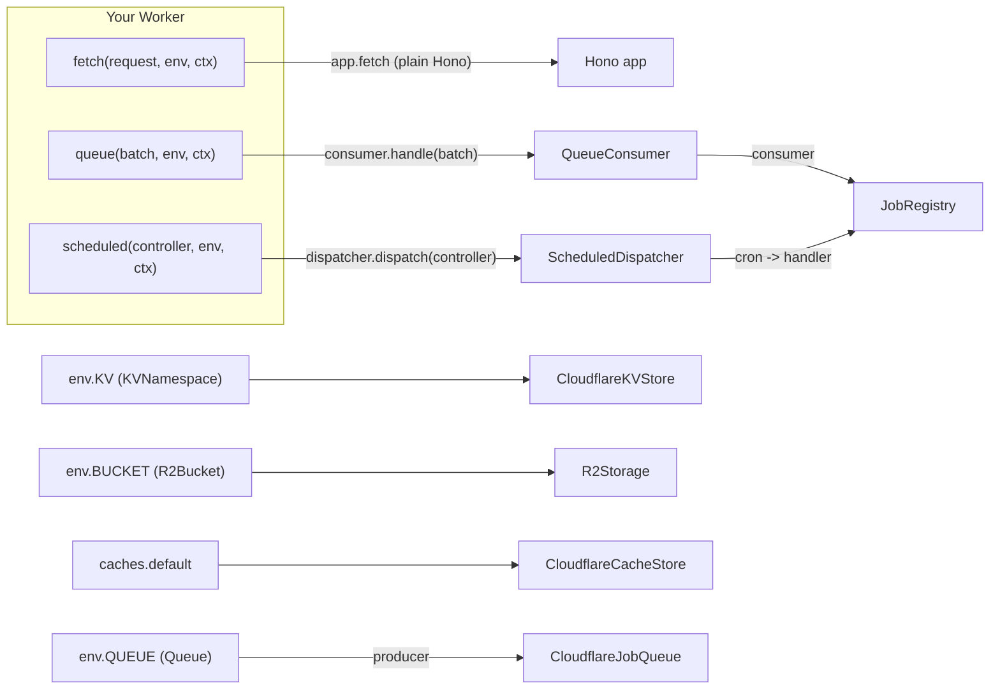

# Deployment

## What / Why

oven's core (`@tknf/oven`, and modules like `@tknf/oven/kv`, `@tknf/oven/storage`,
`@tknf/oven/jobs`) never imports a platform-specific type or calls a
platform-specific API directly — it depends only on abstractions
(`KeyValueStore`, `Storage`, `JobQueue`, ...). Everything that actually talks to
a real backend — a Cloudflare `KVNamespace`, an `R2Bucket`, a Cloudflare Queue,
or the local filesystem — is isolated behind two separate subpath exports:
`@tknf/oven/cloudflare` and `@tknf/oven/node`. Importing the core package
never pulls in `@cloudflare/workers-types` or a Node built-in as a hard
dependency (see [Concepts § Backend-agnostic](./concepts.md#3-backend-agnostic)).

This means moving an app between Cloudflare Workers and a traditional Node
server is, in principle, a change confined to your composition root (the
handful of files that construct adapters and wire them into `ContextAccessor`s)
— application code that calls `storage.put(...)` or `jobQueue.enqueue(...)`
does not change. This guide covers what that wiring looks like on each
platform.

## Minimal example

```ts
// src/main.ts — platform-agnostic app code
import { Hono } from "hono";
import { BooksHandler } from "./handlers/books_handler.js";

const app = new Hono();
app.route("/books", new BooksHandler());

export default app;
```

```ts
// src/server.ts — Node entry point
import { serve } from "@hono/node-server";
import app from "./main.js";

serve({ fetch: app.fetch, port: 3000 });
```

```ts
// src/worker.ts — Cloudflare Workers entry point
import app from "./main.js";

export default {
  fetch: app.fetch,
} satisfies ExportedHandler<CloudflareBindings>;
```

Only the entry point (and the adapters it constructs) differs between the two
targets; `src/main.ts` and everything it imports stays the same.

## Common tasks

### Wiring a Cloudflare Worker

A Cloudflare Worker built with oven typically implements up to three exported
handlers, each backed by a different oven adapter:



**HTTP requests** are handled by plain Hono — oven adds no wrapping here.
`RouteHandler` instances are ordinary Hono apps, so the Worker's `fetch`
handler is just `app.fetch` (or `export default app` directly, since Hono
apps already implement `ExportedHandler["fetch"]`).

**KV, R2, and Cache bindings** each get their own adapter, constructed from
the binding on `env`:

```ts
import { CloudflareKVStore, R2Storage, CloudflareCacheStore } from "@tknf/oven/cloudflare";

const kv = new CloudflareKVStore(env.SESSIONS); // KVNamespace
const storage = new R2Storage(env.UPLOADS); // R2Bucket
const cache = new CloudflareCacheStore({ cache: caches.default }); // Cache
```

All three implement the same core abstractions (`KeyValueStore`, `Storage`)
used by [Storage, Key-Value, and Cache](./storage-kv.md) — nothing downstream
(`SessionStorage`, `FeatureFlags`, `Cache#remember`, your own handlers) needs
to know it's talking to Cloudflare.

**Queues** need a producer/consumer pair. `CloudflareJobQueue` wraps a Queue
binding as a `JobQueue` for enqueuing; `QueueConsumer` wraps the same
`JobRegistry` your producer side uses, and is called from the Worker's
`queue` handler:

```ts
// src/lib/jobs.ts
import { CloudflareJobQueue, QueueConsumer } from "@tknf/oven/cloudflare";
import { JobRegistry } from "@tknf/oven/jobs";
import { GreetJob } from "../jobs/greet_job.js";

export const jobRegistry = new JobRegistry();
jobRegistry.register(new GreetJob());

export const makeJobQueue = (queue: Queue) => new CloudflareJobQueue(queue);
export const queueConsumer = new QueueConsumer(jobRegistry, {
  onUnknownJob: (name) => console.error(`unknown job: ${name}`),
  onJobError: (name, error) => console.error(`job ${name} failed`, error),
});
```

```ts
// src/worker.ts
import app from "./main.js";
import { makeJobQueue, queueConsumer } from "./lib/jobs.js";

export default {
  fetch: app.fetch,
  queue: async (batch, env, ctx) => {
    await queueConsumer.handle(batch);
  },
} satisfies ExportedHandler<CloudflareBindings>;
```

**Cron Triggers** are dispatched by cron expression through
`ScheduledDispatcher`, which throws if a triggered cron string has no matching
handler (a configuration mismatch between `wrangler.jsonc` and your app
surfaces immediately, instead of silently doing nothing):

```ts
// src/lib/scheduled.ts
import { ScheduledDispatcher } from "@tknf/oven/cloudflare";
import { greetSchedule } from "./schedule.js"; // a Schedule instance, see jobs.md

export const scheduledDispatcher = new ScheduledDispatcher({
  "*/5 * * * *": async () => {
    await greetSchedule.runDue();
  },
});
```

```ts
// src/worker.ts
import { scheduledDispatcher } from "./lib/scheduled.js";

export default {
  fetch: app.fetch,
  queue: async (batch) => queueConsumer.handle(batch),
  scheduled: async (controller) => scheduledDispatcher.dispatch(controller),
} satisfies ExportedHandler<CloudflareBindings>;
```

The same `ScheduledDispatcher` entry can drive a database-backed job worker's
`runOnce()` instead of (or alongside) a `Schedule` — see
[Jobs § Running a DB-backed queue](./jobs.md#common-tasks).

### Wiring a Node deployment

A Node deployment is a long-running process, typically behind a load balancer
running more than one instance. Its production storage adapters come from the
same backend-agnostic modules used everywhere else in oven —
`@tknf/oven/kv` and `@tknf/oven/storage` — not from `@tknf/oven/node`, since
every instance needs to see the same state:

```ts
// src/lib/storage.ts
import { S3Storage } from "@tknf/oven/storage";
import { SQLiteDatabaseKeyValueStore, sqliteKeyValueTable } from "@tknf/oven/kv";

export const storage = new S3Storage({
  endpoint: "https://s3.us-east-1.amazonaws.com",
  bucket: "uploads",
  accessKeyId: env.S3_ACCESS_KEY_ID,
  secretAccessKey: env.S3_SECRET_ACCESS_KEY,
  maxBytes: 10 * 1024 * 1024,
  timeoutMs: 10_000,
});

export const kv = new SQLiteDatabaseKeyValueStore(db, sqliteKeyValueTable());
```

`{Pg,SQLite,MySql}DatabaseKeyValueStore`, `S3Storage`, `GoogleCloudStorage`,
and `UpstashRedisStore` depend on nothing platform-specific and behave
identically on any runtime — see
[Storage, Key-Value, and Cache](./storage-kv.md) for the full adapter list.

`@tknf/oven/node` additionally ships `FileKeyValueStore` and `FileStorage`,
which read from and write to the local filesystem — a convenient default for
local development, but intended for single-server use only:

```ts
// src/lib/storage.ts (local development)
import { FileKeyValueStore, FileStorage } from "@tknf/oven/node";

export const kv = new FileKeyValueStore({ directory: "./data/kv" });
export const storage = new FileStorage("./data/uploads");
```

Neither adapter coordinates across multiple processes or machines — running
more than one Node instance against the same directory (or deploying with
these in production at all) will see inconsistent state (see their gotchas
below).

Serving HTTP is plain Hono via `@hono/node-server` (oven ships no Node HTTP
server of its own):

```ts
// src/server.ts
import { serve } from "@hono/node-server";
import app from "./main.js";

serve({ fetch: app.fetch, port: 3000 });
```

Because a Node process stays alive between requests (unlike a Worker
invocation), it's the natural place to run a long-running poll loop instead of
a per-invocation handler — for a DB-backed job queue's worker
(`{Pg,SQLite,MySql}DatabaseJobWorker#run`) and for `Schedule#run`:

```ts
// src/worker-process.ts — a separate long-running process
import { jobRegistry } from "./lib/jobs.js";
import { greetSchedule } from "./lib/schedule.js";
import { SQLiteDatabaseJobWorker, sqliteJobsTable } from "@tknf/oven/jobs";

const worker = new SQLiteDatabaseJobWorker(db, sqliteJobsTable(), jobRegistry, {
  batchSize: 10,
  visibilityTimeoutSeconds: 300,
});

const controller = new AbortController();
process.on("SIGTERM", () => controller.abort());

await Promise.all([
  worker.run({ signal: controller.signal, intervalMs: 1000 }),
  greetSchedule.run({ signal: controller.signal }),
]);
```

### Serving production assets (`@tknf/oven/vite`)

Whichever platform you deploy to, `ViteAssets` resolves fingerprinted asset
paths from your production `manifest.json` (parsed once via
`parseViteManifest`) instead of source paths, and rejects an unknown entry
name (`ViteEntryNotFoundError`) rather than silently emitting a broken URL:

```ts
// src/lib/assets.ts
import { readFile } from "node:fs/promises";
import { ViteAssets, parseViteManifest } from "@tknf/oven/vite";

const manifest = parseViteManifest(
  await readFile("./dist/client/.vite/manifest.json", "utf-8"),
);

export const assets = new ViteAssets({ mode: "production", manifest });
```

`assets.Script`/`assets.Link`/`assets.Img` are then used the same way in
layouts on both platforms — only how `manifest.json` is read (bundled with
the Worker vs. read from disk) differs, and that read is your app's
responsibility, not oven's.

## Gotchas / Security notes

- **Cloudflare Workers have no persistent process-level state.** Each `fetch`
  invocation may run on a fresh isolate; don't cache a `KVNamespace`/`R2Bucket`
  read in a module-level variable expecting it to survive across requests.
  Use `ScopedValueAccessor` with `scope: "request"` for anything that must be
  recreated per request, and reserve `scope: "app"` for values that are truly
  safe to share (e.g. a `ScheduledDispatcher`/`QueueConsumer` instance built
  once at module load, since it holds no per-request state itself) — see
  [Concepts § Dependency injection](./concepts.md#dependency-injection).
- **Cloudflare Queues delivery is at-least-once.** `QueueConsumer` retries any
  message whose job throws (`message.retry()`) and acks-and-discards unknown
  job names rather than retrying them forever — see
  [Jobs § Gotchas](./jobs.md#gotchas--security-notes) for why `perform` must be
  idempotent regardless of which queue adapter is in front of it.
- **`CloudflareCacheStore` is per-data-center, not globally replicated** —
  unlike `CloudflareKVStore`, a value cached in one colo can miss in another.
  Only use it for speculative caching, never for sessions or rate limiting
  (see the class's own doc comment in `src/cloudflare/cloudflare_cache_store.ts`).
- **`FileKeyValueStore`/`FileStorage` are for development and single-server
  use.** `FileKeyValueStore` only expires keys lazily on `get` (no background
  GC), and neither adapter coordinates across multiple processes or machines
  — running more than one Node instance against the same directory (or
  deploying with these in production at all) will see inconsistent state.
- **`{Pg,SQLite,MySql}DatabaseJobWorker#run` is a long-running loop; it does
  not belong in a Cloudflare Worker**, which has no persistent process to run
  it in. On Cloudflare, call `worker.runOnce()` directly from a `scheduled`
  handler instead (via `ScheduledDispatcher`, as shown above).
- **Keep credentials in your platform's secret store, not in checked-in
  config.** Cloudflare bindings (`env.KV`, `env.BUCKET`, `env.QUEUE`) are
  configured in `wrangler.jsonc`/the dashboard and injected at runtime; Node
  deployments should read equivalent values (S3/GCS keys, database URLs) from
  environment variables. Neither `CloudflareKVStore`/`R2Storage` nor
  `FileKeyValueStore`/`FileStorage` do any credential handling themselves —
  they only wrap a binding or a local path you already control.

## See also

- [Concepts](./concepts.md) — the backend-agnostic principle and the
  `register`/`use` composition-root convention these adapters plug into.
- [Storage, Key-Value, and Cache](./storage-kv.md) — the `Storage`/
  `KeyValueStore`/`Cache` abstractions that `R2Storage`, `CloudflareKVStore`,
  `CloudflareCacheStore`, `FileStorage`, and `FileKeyValueStore` implement.
- [Jobs](./jobs.md) — `JobQueue`/`JobRegistry`/`Schedule`, and the full
  `CloudflareJobQueue`/`QueueConsumer`/`ScheduledDispatcher` job-processing
  picture.
- [Realtime](./realtime.md) — `Broadcaster` and its transports, another
  backend-agnostic abstraction with its own adapter set.
