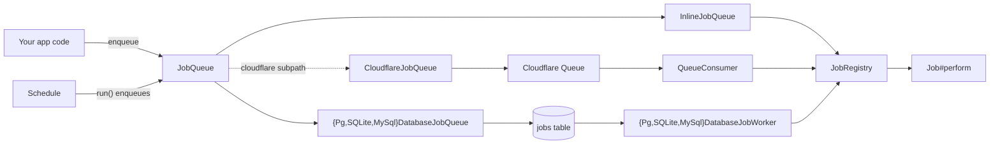

# Jobs

## What / Why

`@tknf/oven/jobs` models one job as one class: subclass `Job<TPayload>`,
give it a unique `name`, and implement `perform(payload)`. `TPayload` must
be JSON-serializable — it is `JSON.stringify`d at enqueue time and
`JSON.parse`d back on the consumer side, so it has to round-trip through
that boundary unchanged (no functions, `Date`, `Map`/`Set`, circular
references).

Three pieces stay deliberately separate:

- **`Job`** — the unit of work (`name` + `perform`).
- **`JobRegistry`** — a name-to-job lookup table. Both the enqueue side
  (`InlineJobQueue`) and every consumer (`QueueConsumer`,
  `{Pg,SQLite,MySql}DatabaseJobWorker`) resolve jobs through the same
  registry, so a missing `register` call surfaces the same way everywhere.
- **`JobQueue`** — the enqueue side. `enqueue<TPayload>(job, payload,
  options?)` is generic so the compiler enforces that `job` and `payload`
  agree at the call site. Adapters: `InlineJobQueue` (dev/test — runs
  immediately, no transport), and two adapters that carry jobs over a real
  transport: `CloudflareJobQueue` (forwards to a Cloudflare Queues binding;
  paired with `QueueConsumer` on the consumer side, both under
  `@tknf/oven/cloudflare`) and `{Pg,SQLite,MySql}DatabaseJobQueue` (uses your
  existing relational database as the queue; paired with the matching
  `*DatabaseJobWorker`).

`Schedule` is a separate, minimal cron-to-handler table (its own zero-dependency
matcher) for periodically calling `run: () => queue.enqueue(job, payload)` —
it doesn't run jobs itself, it just decides when to enqueue them.



## Minimal example

```ts
// src/jobs/greet_job.ts
import { Job } from "@tknf/oven/jobs";

type GreetPayload = { name: string };

export class GreetJob extends Job<GreetPayload> {
  readonly name = "greet";

  async perform(payload: GreetPayload): Promise<void> {
    console.log(`Hello, ${payload.name}!`);
  }
}
```

```ts
// src/lib/jobs.ts
import { InlineJobQueue, JobRegistry } from "@tknf/oven/jobs";
import { GreetJob } from "../jobs/greet_job.js";

export const jobRegistry = new JobRegistry();
export const greetJob = new GreetJob();
jobRegistry.register(greetJob);

// Development/test: runs perform() immediately, still through the registry
// (so a forgotten `register` call fails the same way it would in production).
export const jobQueue = new InlineJobQueue(jobRegistry);
```

```ts
// src/main.ts
import { Hono } from "hono";
import { jobQueue, greetJob } from "./lib/jobs.js";

const app = new Hono();

app.post("/signup", async (c) => {
  const { name } = await c.req.json<{ name: string }>();
  await jobQueue.enqueue(greetJob, { name });
  return c.body(null, 202);
});

export default app;
```

## Common tasks

**Defining a job:** subclass `Job<TPayload>`, give it a unique `name`, and
throw from `perform` on failure — the consumer-side dispatcher (whichever
adapter you use) routes a thrown error to its retry path.

**Registering and enqueuing:**

```ts
const registry = new JobRegistry();
registry.register(new GreetJob());

await jobQueue.enqueue(new GreetJob(), { name: "Alice" }, { delaySeconds: 60, priority: -1 });
```

`options.delaySeconds` must be a non-negative integer; `options.priority`
must be an integer (lower runs first). Both are validated by every adapter
before anything is sent — an invalid value throws instead of being
silently rounded or ignored.

**Running jobs immediately in dev/tests with `InlineJobQueue`:**

```ts
import { InlineJobQueue, JobRegistry } from "@tknf/oven/jobs";

const registry = new JobRegistry();
registry.register(new GreetJob());

const queue = new InlineJobQueue(registry);
await queue.enqueue(new GreetJob(), { name: "Alice" }); // perform() has already run by the time this resolves
```

**Running a DB-backed queue with its worker** (SQLite shown; `Pg`/`MySql`
variants share the same method vocabulary):

```ts
import {
  SQLiteDatabaseJobQueue,
  SQLiteDatabaseJobWorker,
  sqliteJobsTable,
  JobRegistry,
} from "@tknf/oven/jobs";

const jobsTable = sqliteJobsTable(); // default schema; generate its migration via your drizzle-kit setup
const registry = new JobRegistry();
registry.register(new GreetJob());

const queue = new SQLiteDatabaseJobQueue(db, jobsTable);
await queue.enqueue(new GreetJob(), { name: "Alice" });

const worker = new SQLiteDatabaseJobWorker(db, jobsTable, registry, {
  maxAttempts: 5,
  backoffSeconds: (attempt) => Math.min(3600, 30 * 2 ** (attempt - 1)), // default shown explicitly
  visibilityTimeoutSeconds: 300,
  batchSize: 10,
});

// One-off (e.g. driven from a Cloudflare cron via ScheduledDispatcher):
await worker.runOnce();

// Or a long-running poll loop (e.g. a Node worker process):
const controller = new AbortController();
await worker.run({ signal: controller.signal, intervalMs: 1000 });
```

Use the matching `{Pg,SQLite,MySql}JobsConsole` to inspect/operate on the
table directly (`listPending`, `listFailed`, `retryFailed(id)`,
`deleteJob(id)`) — it has no HTTP or HTML surface of its own; wiring it
into an admin endpoint is your app's job.

**Deploying to Cloudflare Queues:** see [Deployment](./deployment.md)
for wiring `CloudflareJobQueue` (producer) and `QueueConsumer` (consumer,
called from your Worker's `queue(batch, env, ctx)` handler) to a Queue
binding, and `ScheduledDispatcher`/`Schedule#runDue` to a `scheduled`
handler.

## Gotchas / Security notes

- **Delivery is at-least-once everywhere — `perform` must be idempotent.**
  `QueueConsumer` retries on a thrown error; the DB workers re-claim a row
  once `visibilityTimeoutSeconds` elapses if a worker crashed between
  finishing `perform` and deleting the row. Either path can re-run the same
  payload.
- **`InlineJobQueue` is for development and tests, not production.** It
  never actually waits `delaySeconds` (only validates it) and runs
  synchronously with no retry/backoff — every failure propagates straight
  to the caller of `enqueue`.
- **Unregistered job names are never retried, only reported.**
  `QueueConsumer` acks-and-discards; the DB workers mark the row
  `failedAt` immediately. Both call `hooks.onUnknownJob` so you can detect
  it — an unknown name usually means a stale message from a job that was
  since removed, and retrying it would only create a poison message. A
  message body that isn't even shaped like `{ name, payload }` (e.g. `null`
  or a non-string `name`) is treated the same way — acked and reported to
  `onUnknownJob` with `""` — so one malformed message can't block the rest
  of the batch.
- **The DB-backed workers don't use dialect-specific locking** (no
  `SELECT ... FOR UPDATE SKIP LOCKED`) — claiming is a SELECT followed by
  an optimistic per-row UPDATE, so the same claim algorithm works
  identically across SQLite/Postgres/MySQL. This means claim throughput is
  bounded by row-level contention, not designed for very high concurrency.
- **`{Pg,SQLite,MySql}DatabaseJobWorker#run` is for long-running processes**
  (e.g. Node). It is not for Cloudflare Workers — there, call `runOnce()`
  directly from a `scheduled` handler via `ScheduledDispatcher` instead.
- **`Schedule#runDue` matches at minute granularity.** Calling it more than
  once within the same minute runs the same due entries again — the caller
  is responsible for not doing that (e.g. don't call it from both a
  1-second poll loop and a cron trigger for the same schedule).
- **Payloads must be JSON-serializable**, and this is not enforced by the
  type system — passing something that doesn't round-trip through
  `JSON.stringify`/`JSON.parse` (functions, `Date`, circular references)
  will silently corrupt the payload the consumer sees.

## See also

- [Storage, Key-Value, and Cache](./storage-kv.md) — jobs and caching share
  the same backend-independent, constructor-injected design; the DB-backed
  job queues sit next to the DB-backed `KeyValueStore` adapters.
- [Concepts](./concepts.md) — the composition/constructor-injection
  convention used across oven, including `JobQueue`/`JobRegistry`.
