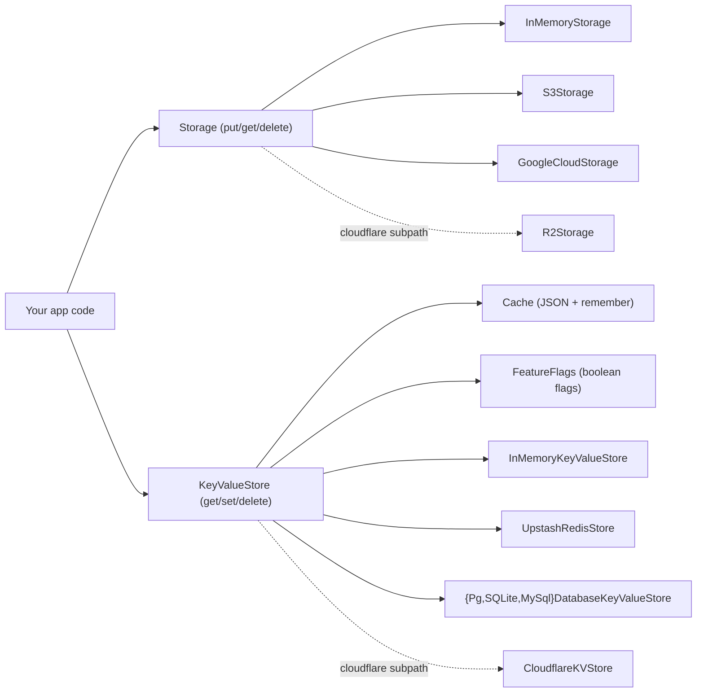

# Storage, Key-Value, and Cache

## What / Why

`@tknf/oven/storage`, `@tknf/oven/kv`, and `@tknf/oven/cache` share one
design: an abstract base class that depends on no specific backend, plus a
handful of adapters you inject via the constructor. None of these bases
know anything about Cloudflare bindings (`R2Bucket`, `KVNamespace`) —
binding-specific adapters live under the separate `@tknf/oven/cloudflare`
subpath (`R2Storage`, `CloudflareKVStore`, `CloudflareCacheStore`), so the
core stays deployable to any runtime.

- **`Storage`** (`put`/`get`/`delete`) stores blobs under a string key.
  Adapters: `InMemoryStorage` (dev/test), `S3Storage` (any S3-compatible
  API — AWS S3, R2, MinIO), `GoogleCloudStorage` (GCS JSON API), and
  `R2Storage` (Cloudflare binding, under `@tknf/oven/cloudflare`). Issuing a
  time-limited download URL is a separate capability, `Presigner`
  (`presignGet`), implemented by `S3UrlSigner` — separate because not every
  `Storage` backend can presign with the credentials it already has (an
  `R2Bucket` binding, for instance, cannot presign on its own).
- **`KeyValueStore`** (`get`/`set` with an optional TTL/`delete`) stores a
  single string value under a string key. Adapters: `InMemoryKeyValueStore`
  (dev/test), `UpstashRedisStore`, `{Pg,SQLite,MySql}DatabaseKeyValueStore`
  (your existing RDB as the store), and `CloudflareKVStore` (under
  `@tknf/oven/cloudflare`). `FeatureFlags` is a thin, opinionated layer on
  top for global boolean flags.
- **`Cache`** wraps a `KeyValueStore` with JSON (de)serialization and a
  `remember` helper (compute-and-store-if-missing, with optional
  stale-while-revalidate).

All three are built on the same eventual-consistency contract: a `get`
immediately after a `set` may return a stale value on some backends (e.g.
Cloudflare KV), and TTL is a cleanup hint, not a precise expiry guarantee.
Don't build logic on top of these abstractions that requires strong
consistency or exact expiry timing.



## Minimal example

```ts
// src/lib/storage.ts
import { InMemoryStorage } from "@tknf/oven/storage";
import type { Storage } from "@tknf/oven/storage";

export const storage: Storage = new InMemoryStorage();
```

```ts
// src/main.ts
import { Hono } from "hono";
import { storage } from "./lib/storage.js";

const app = new Hono();

app.put("/uploads/:key", async (c) => {
  const body = await c.req.arrayBuffer();
  await storage.put(c.req.param("key"), body, c.req.header("content-type") ?? "application/octet-stream");
  return c.body(null, 204);
});

app.get("/uploads/:key", async (c) => {
  const object = await storage.get(c.req.param("key"));
  if (!object) return c.notFound();
  return new Response(object.body, {
    headers: { "content-type": object.contentType ?? "application/octet-stream" },
  });
});

export default app;
```

Swapping the backend for production is a one-line change at the
composition root — no caller code above changes:

```ts
// src/lib/storage.ts (production)
import { S3Storage } from "@tknf/oven/storage";

export const storage = new S3Storage({
  endpoint: "https://s3.us-east-1.amazonaws.com",
  bucket: "uploads",
  accessKeyId: env.S3_ACCESS_KEY_ID,
  secretAccessKey: env.S3_SECRET_ACCESS_KEY,
  maxBytes: 10 * 1024 * 1024,
  timeoutMs: 10_000,
});
```

The same code points at R2 instead just by swapping the endpoint (e.g.
`https://<account_id>.r2.cloudflarestorage.com`) and credentials.

## Common tasks

**Issuing a presigned download URL** (`Presigner`, implemented by
`S3UrlSigner` for S3-compatible APIs such as AWS S3, R2, and MinIO):

```ts
import { S3UrlSigner } from "@tknf/oven/storage";

const signer = new S3UrlSigner({
  endpoint: "https://s3.us-east-1.amazonaws.com",
  bucket: "uploads",
  accessKeyId: env.S3_ACCESS_KEY_ID,
  secretAccessKey: env.S3_SECRET_ACCESS_KEY,
});

const url = await signer.presignGet("reports/2026-07.pdf", 300); // expires in 5 minutes
```

**Reading and writing a KV entry with a TTL:**

```ts
import { InMemoryKeyValueStore } from "@tknf/oven/kv";

const store = new InMemoryKeyValueStore();

await store.set("rate-limit:user-1", "3", 60); // cleaned up after ~60s
const value = await store.get("rate-limit:user-1"); // "3", or null once expired/missing
await store.delete("rate-limit:user-1");
```

**Toggling a global feature flag with `FeatureFlags`:**

```ts
import { FeatureFlags } from "@tknf/oven/kv";

const flags = new FeatureFlags(store); // any KeyValueStore

await flags.enable("beta-dashboard");
if (await flags.enabled("beta-dashboard")) {
  // ...
}
await flags.disable("beta-dashboard"); // writes "0", distinct from "never configured"
await flags.remove("beta-dashboard"); // back to unconfigured (enabled() -> false)
```

**Caching a computed value with `Cache#remember`:**

```ts
import { Cache } from "@tknf/oven/cache";

const cache = new Cache(store); // any KeyValueStore

const report = await cache.remember("report:2026-07", 300, async () => {
  return computeExpensiveReport(); // only runs on a cache miss
});
```

Add stale-while-revalidate to serve a stale value while recomputing in the
background (requires `ttlSeconds`):

```ts
const report = await cache.remember(
  "report:2026-07",
  300,
  () => computeExpensiveReport(),
  { staleWhileRevalidateSeconds: 60, waitUntil: c.executionCtx.waitUntil.bind(c.executionCtx) },
);
```

## Gotchas / Security notes

- **Sanitize user-supplied `Storage`/`KeyValueStore` keys yourself.**
  Neither abstraction rejects `..` or path separators in a key by default.
  `S3Storage`/`S3UrlSigner` do reject `..` path segments internally (to
  stop bucket-prefix traversal through their signing/URL logic), but that
  is a backend-specific safety net, not a substitute for validating input
  at the application boundary — apply the same discipline to
  `KeyValueStore` keys, which have no such built-in check at all.
- **`Cache` values must be JSON-serializable, and `null`/`undefined` can't
  be cached.** `put` throws if `JSON.stringify` would produce `undefined`.
  `remember`'s `compute` returning `null`/`undefined` is not stored — the
  value is handed back as-is and recomputed on the next call.
- **Don't toggle stale-while-revalidate on and off for the same cache key.**
  Enabling `options` changes the stored shape to an envelope
  (`{ value, freshUntil }`); a plain JSON value read back under SWR mode is
  treated as a miss and overwritten, and once a key is in envelope format
  it stays there.
- **`FeatureFlags#enabled` is fail-closed** — any stored value other than
  `"1"` (unset, `"0"`, or anything unexpected) reads as disabled. If the
  underlying store throws, that error propagates to the caller rather than
  being swallowed into "disabled".
- **`InMemoryStorage`/`InMemoryKeyValueStore` are for development and
  tests only** — nothing is persisted, and state is lost on restart.
- **Keep S3/GCS credentials out of source.** `S3Storage`/`S3UrlSigner` take
  `accessKeyId`/`secretAccessKey` as plain constructor values, and
  `GoogleCloudStorage` takes a `tokenProvider` callback — source these from
  your platform's secret store (e.g. Worker secrets), not from checked-in
  config. `GoogleCloudStorage` does no key management or JWT signing
  itself; obtaining and refreshing the token is your application's job.

## See also

- [Concepts](./concepts.md) — the constructor-injection convention shared
  across `Storage`/`KeyValueStore`/`Cache` and the rest of oven.
- [Sessions](./sessions.md) — `SessionStorage` follows the same
  backend-independent, constructor-injected pattern (and some session
  backends are themselves built on `KeyValueStore`).
- [Security](./security.md) — secret/key handling conventions shared across
  oven (`SECURITY.md` covers the storage-key sanitization requirement in
  full).
