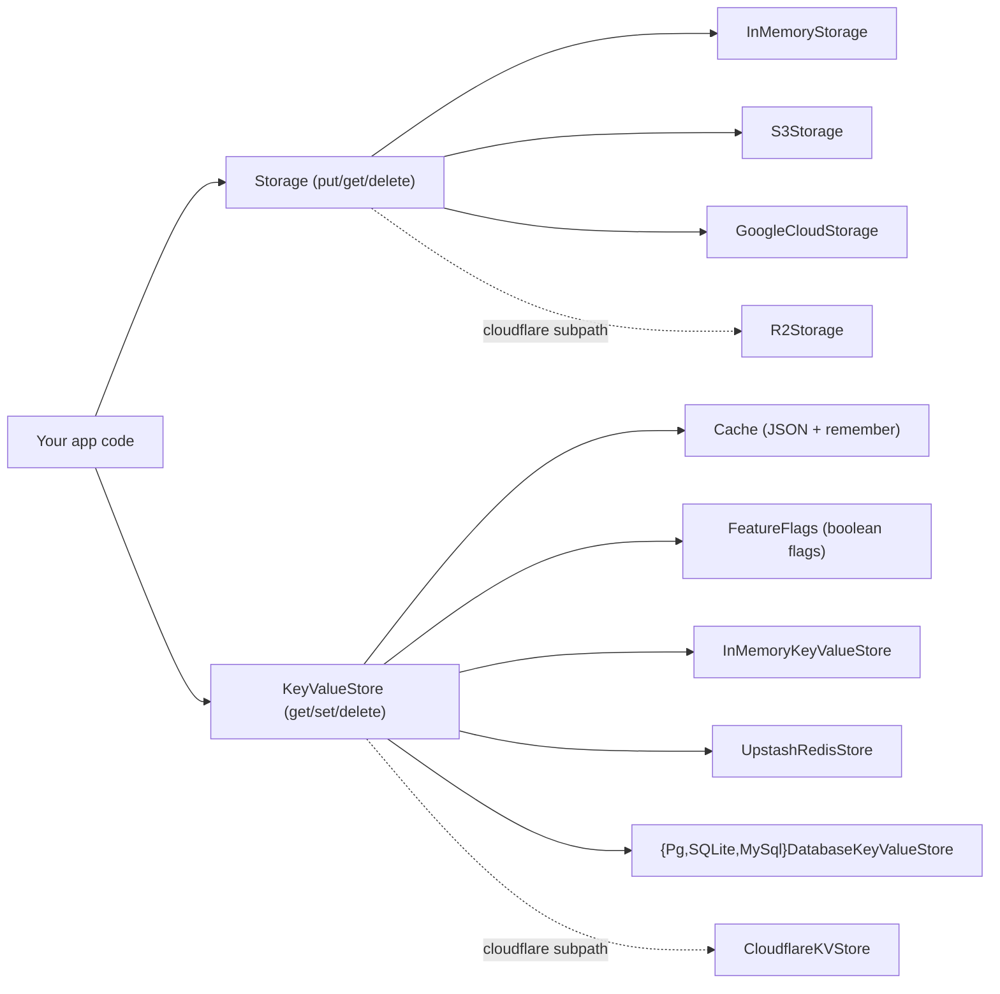

# Storage, Key-Value, and Cache

## What / Why

`@tknf/oven/storage`, `@tknf/oven/kv`, and `@tknf/oven/cache` share one
design: an abstract base class that depends on no specific backend, plus a
handful of adapters you inject via the constructor. None of these bases
know anything about Cloudflare bindings (`R2Bucket`, `KVNamespace`) —
binding-specific adapters live under the separate `@tknf/oven/cloudflare`
subpath (`R2Storage`, `CloudflareKVStore`, `CloudflareCacheStore`), so the
core stays deployable to any runtime.

- **`Storage`** (`put`/`get`/`delete`) stores blobs under a string key.
  Adapters: `InMemoryStorage` (dev/test), `S3Storage` (any S3-compatible
  API — AWS S3, R2, MinIO), `GoogleCloudStorage` (GCS JSON API), and
  `R2Storage` (Cloudflare binding, under `@tknf/oven/cloudflare`). Issuing a
  time-limited download URL is a separate capability, `Presigner`
  (`presignGet`), implemented by `S3UrlSigner` (S3-compatible APIs, HMAC-SHA256
  via aws4fetch) and `GcsUrlSigner` (GCS, RSA-signed V4 URLs via a service
  account key) — separate because not every `Storage` backend can presign with
  the credentials it already has (an `R2Bucket` binding, for instance, cannot
  presign on its own).
  Client-driven multipart uploads are another optional capability,
  `MultipartUploader`, implemented by `R2Storage` and `InMemoryStorage`.
- **`KeyValueStore`** (`get`/`set` with an optional TTL/`delete`) stores a
  single string value under a string key. Adapters: `InMemoryKeyValueStore`
  (dev/test), `UpstashRedisStore`, `{Pg,SQLite,MySql}DatabaseKeyValueStore`
  (your existing RDB as the store), and `CloudflareKVStore` (under
  `@tknf/oven/cloudflare`). `FeatureFlags` is a thin, opinionated layer on
  top for global boolean flags.
- **`Cache`** wraps a `KeyValueStore` with JSON (de)serialization and a
  `remember` helper (compute-and-store-if-missing, with optional
  stale-while-revalidate).

All three are built on the same eventual-consistency contract: a `get`
immediately after a `set` may return a stale value on some backends (e.g.
Cloudflare KV), and TTL is a cleanup hint, not a precise expiry guarantee.
Don't build logic on top of these abstractions that requires strong
consistency or exact expiry timing.


```mermaid
flowchart LR
    App["Your app code"] --> Storage["Storage (put/get/delete)"]
    App --> KV["KeyValueStore (get/set/delete)"]
    KV --> Cache["Cache (JSON + remember)"]
    KV --> FeatureFlags["FeatureFlags (boolean flags)"]
    Storage --> InMemoryStorage
    Storage --> S3Storage
    Storage --> GoogleCloudStorage
    Storage -.cloudflare subpath.-> R2Storage
    KV --> InMemoryKeyValueStore
    KV --> UpstashRedisStore
    KV --> DatabaseKeyValueStore["{Pg,SQLite,MySql}DatabaseKeyValueStore"]
    KV -.cloudflare subpath.-> CloudflareKVStore
```

## Minimal example

```ts
// src/lib/storage.ts
import { InMemoryStorage } from "@tknf/oven/storage";
import type { Storage } from "@tknf/oven/storage";

export const storage: Storage = new InMemoryStorage();
```

```ts
// src/main.ts
import { Hono } from "hono";
import { storage } from "./lib/storage.js";

const app = new Hono();

app.put("/uploads/:key", async (c) => {
  const body = await c.req.arrayBuffer();
  await storage.put(c.req.param("key"), body, c.req.header("content-type") ?? "application/octet-stream");
  return c.body(null, 204);
});

app.get("/uploads/:key", async (c) => {
  const object = await storage.get(c.req.param("key"));
  if (!object) return c.notFound();
  return new Response(object.body, {
    headers: { "content-type": object.contentType ?? "application/octet-stream" },
  });
});

export default app;
```

Swapping the backend for production is a one-line change at the
composition root — no caller code above changes:

```ts
// src/lib/storage.ts (production)
import { S3Storage } from "@tknf/oven/storage";

export const storage = new S3Storage({
  endpoint: "https://s3.us-east-1.amazonaws.com",
  bucket: "uploads",
  accessKeyId: env.S3_ACCESS_KEY_ID,
  secretAccessKey: env.S3_SECRET_ACCESS_KEY,
  maxBytes: 10 * 1024 * 1024,
  timeoutMs: 10_000,
});
```

The same code points at R2 instead just by swapping the endpoint (e.g.
`https://<account_id>.r2.cloudflarestorage.com`) and credentials.

## Common tasks

**Issuing a presigned download URL** (`Presigner`, implemented by
`S3UrlSigner` for S3-compatible APIs such as AWS S3, R2, and MinIO):

```ts
import { S3UrlSigner } from "@tknf/oven/storage";

const signer = new S3UrlSigner({
  endpoint: "https://s3.us-east-1.amazonaws.com",
  bucket: "uploads",
  accessKeyId: env.S3_ACCESS_KEY_ID,
  secretAccessKey: env.S3_SECRET_ACCESS_KEY,
});

const url = await signer.presignGet("reports/2026-07.pdf", 300); // expires in 5 minutes
```

For GCS, `GcsUrlSigner` issues V4 (`GOOG4-RSA-SHA256`) signed URLs, signed
with a service account's RSA private key via Web Crypto (no third-party JWT
library). `clientEmail`/`privateKeyPem` are the `client_email`/`private_key`
fields of a downloaded service account JSON key:

```ts
import { GcsUrlSigner } from "@tknf/oven/storage";

const signer = new GcsUrlSigner({
  bucket: "uploads",
  clientEmail: env.GCS_CLIENT_EMAIL, // service account JSON key's "client_email"
  privateKeyPem: env.GCS_PRIVATE_KEY, // service account JSON key's "private_key"
});

const url = await signer.presignGet("reports/2026-07.pdf", 300); // expires in 5 minutes (1..604800s)
```

**Uploading large objects in one `put` call** — the remote adapters below switch to a
multi-request upload API once a `put` body crosses 100 MiB, but the protocol
and the streaming story differ per backend, so pick the adapter with your
upload shape in mind:

- **`S3Storage`** buffers a `ReadableStream` fully into memory first (SigV4
  signing needs the whole body up front — see the class doc), then, once the
  buffered size is known, switches a `Blob`/`ArrayBuffer` above 100 MiB to
  S3's Multipart Upload API (`CreateMultipartUpload`/`UploadPart`/
  `CompleteMultipartUpload`, aborting via `AbortMultipartUpload` on failure).
- **`GoogleCloudStorage`** switches a `Blob`/`ArrayBuffer` above 100 MiB to
  GCS's resumable upload protocol (initiate, then PUT fixed-size chunks to
  the returned session URI, canceling the session on failure — mirroring
  `S3Storage`'s `AbortMultipartUpload` on failure). A `ReadableStream` always
  stays on the simple `uploadType=media` upload, passed through to `fetch`
  unbuffered, regardless of size — this is the one adapter where a stream
  never triggers the large-object path.
- **`R2Storage`** (under `@tknf/oven/cloudflare`) switches to R2's Multipart
  Upload API above 100 MiB for all three body types, including a
  `ReadableStream` (chunked on the fly via a lookahead reader, so it need not
  be buffered first the way `S3Storage`'s does).

None of this changes the call site — `storage.put(key, data, contentType)`
looks the same either way.

### Client-driven multipart uploads

Use the separate `MultipartUploader` interface when creation, each part,
completion, and cancellation happen in separate HTTP requests. This is the
shared capability chosen for this use case; `Storage` remains
`put`/`get`/`delete`, and `R2Storage.put()` keeps its automatic multipart behavior.
The capability and its plain-data types are exported from `@tknf/oven/storage`:

| Method | Result |
| --- | --- |
| `createMultipartUpload(key, contentType)` | `MultipartUpload`: `{ key, uploadId }` |
| `uploadPart(upload, partNumber, body)` | `UploadedPart`: `{ partNumber, etag }` |
| `completeMultipartUpload(upload, parts)` | `void` after publishing the object |
| `abortMultipartUpload(upload)` | `void` after discarding pending parts |

```ts
import { R2Storage } from "@tknf/oven/cloudflare";
import type { MultipartUpload, MultipartUploader, UploadedPart } from "@tknf/oven/storage";

const uploader: MultipartUploader = new R2Storage(env.UPLOADS);

// Creation request: return this plain object to the client.
const upload: MultipartUpload = await uploader.createMultipartUpload(
  "uploads/video.mp4", "video/mp4",
);

// Each part request: reuse the reference, including with a new R2Storage instance.
// `body` is that request's Blob, ArrayBuffer, or non-null ReadableStream.
const part: UploadedPart = await uploader.uploadPart(upload, 1, body);

// Completion request: the client sends the collected, current part metadata.
await uploader.completeMultipartUpload(upload, [part]);

// For cancellation, call this instead of completion:
// await uploader.abortMultipartUpload(upload);
```

The client retains `{ key, uploadId }` and every `{ partNumber, etag }` across
requests. Upload parts with positive integer numbers and complete with a
nonempty list in ascending order without duplicates. Re-uploading a part
number replaces it; retain the latest returned ETag as an opaque value.
Only the selected parts become the object at completion, overwriting any
existing object at that key. Creation and abort leave an existing object intact.
Completion returns no provider-specific object metadata, consistent with `put()`.

`R2Storage` resumes the R2 upload for each operation and passes part bodies
directly to the binding. Follow R2's part-size/count constraints: normally use
equal-sized parts of at least 5 MiB (for example, 10 MiB), with a smaller final
part allowed and no more than 10,000 parts. See the
[R2 multipart guide](https://developers.cloudflare.com/r2/api/workers/workers-multipart-usage/)
and [upload limits](https://developers.cloudflare.com/r2/objects/upload-objects/#multipart-upload-details).
Errors propagate without automatic retries or aborts; the caller can retry a
failed step or explicitly abort. Do not assume a reference is still active,
or that complete/abort races or repeated completion succeed.

For unit tests, inject one `InMemoryStorage` instance as `Storage & MultipartUploader`.
It retains pending uploads on that instance, accepts small test parts, validates
upload references and completion metadata, and exposes the assembled bytes via
`get()`. Its ETags are opaque test identifiers, not content hashes. It buffers
all parts and does not simulate R2 size/count limits, expiry, or provider error
types. Use R2 binding integration tests for those backend behaviors.
`S3Storage`, `GoogleCloudStorage`, and `FileStorage` do not implement this capability.

**Reading and writing a KV entry with a TTL:**

```ts
import { InMemoryKeyValueStore } from "@tknf/oven/kv";

const store = new InMemoryKeyValueStore();

await store.set("rate-limit:user-1", "3", 60); // cleaned up after ~60s
const value = await store.get("rate-limit:user-1"); // "3", or null once expired/missing
await store.delete("rate-limit:user-1");
```

**Toggling a global feature flag with `FeatureFlags`:**

```ts
import { FeatureFlags } from "@tknf/oven/kv";

const flags = new FeatureFlags(store); // any KeyValueStore

await flags.enable("beta-dashboard");
if (await flags.enabled("beta-dashboard")) {
  // ...
}
await flags.disable("beta-dashboard"); // writes "0", distinct from "never configured"
await flags.remove("beta-dashboard"); // back to unconfigured (enabled() -> false)
```

**Caching a computed value with `Cache#remember`:**

```ts
import { Cache } from "@tknf/oven/cache";

const cache = new Cache(store); // any KeyValueStore

const report = await cache.remember("report:2026-07", 300, async () => {
  return computeExpensiveReport(); // only runs on a cache miss
});
```

Add stale-while-revalidate to serve a stale value while recomputing in the
background (requires `ttlSeconds`):

```ts
const report = await cache.remember(
  "report:2026-07",
  300,
  () => computeExpensiveReport(),
  { staleWhileRevalidateSeconds: 60, waitUntil: c.executionCtx.waitUntil.bind(c.executionCtx) },
);
```

## Gotchas / Security notes

- **Multipart references do not authorize uploads.** Authenticate each endpoint,
  validate client JSON and part metadata, and bind the key/upload ID to the
  authorized user or tenant on every step. Enforce per-request and total upload
  limits in the application; the capability does not track quotas. For
  cookie-authenticated browser uploads, send `X-CSRF-Token` and apply a separate
  request-body limit. Arrange cleanup for abandoned uploads using the backend's
  lifecycle policy or explicit aborts.
- **Sanitize user-supplied `Storage`/`KeyValueStore` keys yourself.**
  Neither abstraction rejects `..` or path separators in a key by default.
  `S3Storage`/`S3UrlSigner`/`GcsUrlSigner` do reject `..` path segments
  internally (to stop bucket-prefix traversal through their signing/URL
  logic), but that is a backend-specific safety net, not a substitute for
  validating input at the application boundary — apply the same discipline
  to `KeyValueStore` keys, which have no such built-in check at all.
- **`Cache` values must be JSON-serializable, and `null`/`undefined` can't
  be cached.** `put` throws if `JSON.stringify` would produce `undefined`.
  `remember`'s `compute` returning `null`/`undefined` is not stored — the
  value is handed back as-is and recomputed on the next call.
- **Don't toggle stale-while-revalidate on and off for the same cache key.**
  Enabling `options` changes the stored shape to an envelope
  (`{ value, freshUntil }`); a plain JSON value read back under SWR mode is
  treated as a miss and overwritten, and once a key is in envelope format
  it stays there.
- **`FeatureFlags#enabled` is fail-closed** — any stored value other than
  `"1"` (unset, `"0"`, or anything unexpected) reads as disabled. If the
  underlying store throws, that error propagates to the caller rather than
  being swallowed into "disabled".
- **`InMemoryStorage`/`InMemoryKeyValueStore` are for development and
  tests only** — nothing is persisted, and state is lost on restart.
- **The DB-backed `{Pg,SQLite,MySql}DatabaseKeyValueStore` adapters don't
  run background GC.** An expired row is only deleted incidentally, on the
  next `get` that happens to hit it — nothing sweeps rows nobody reads
  again. Schedule `{Pg,SQLite,MySql}PruneExpiredRecordsJob`
  (`@tknf/oven/jobs`) to actually clear expired rows out of the table; see
  [Jobs](./jobs.md#common-tasks).
- **Keep S3/GCS credentials out of source.** `S3Storage`/`S3UrlSigner` take
  `accessKeyId`/`secretAccessKey` as plain constructor values, and
  `GoogleCloudStorage` takes a `tokenProvider` callback — source these from
  your platform's secret store (e.g. Worker secrets), not from checked-in
  config. `GoogleCloudStorage` does no key management or JWT signing
  itself; obtaining and refreshing the token is your application's job.
  `GcsUrlSigner`'s `privateKeyPem` is equally sensitive (it can sign a
  download URL for anything in the bucket) — same rule applies.

## See also

- [Concepts](./concepts.md) — the constructor-injection convention shared
  across `Storage`/`KeyValueStore`/`Cache` and the rest of oven.
- [Sessions](./sessions.md) — `SessionStorage` follows the same
  backend-independent, constructor-injected pattern (and some session
  backends are themselves built on `KeyValueStore`).
- [Jobs](./jobs.md) — `{Pg,SQLite,MySql}PruneExpiredRecordsJob` GCs expired
  rows out of a DB-backed `KeyValueStore`/`SessionStorage` table.
- [Security](./security.md) — secret/key handling conventions shared across
  oven (`SECURITY.md` covers the storage-key sanitization requirement in
  full).
