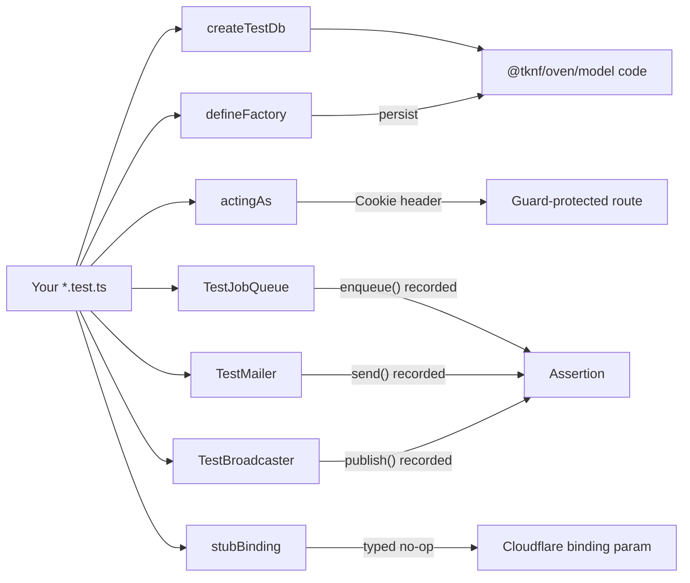

# Testing

## What / Why

`@tknf/oven/test` is the test harness half of oven: a small set of
framework-independent utilities for exercising the rest of the framework
without touching a real database, queue, mailer, or Cloudflare binding.
None of it is loaded from the core `@tknf/oven` entry point — it's an
explicit, separate subpath so test-only code never ships in a production
bundle.

- **`createTestDb`** — spins up a throwaway, file-based libSQL database and
  applies your Drizzle migrations to it, so `@tknf/oven/model`/`database`
  code can be tested against a real (if temporary) SQL engine instead of a
  mock.
- **`defineFactory`** — test data factories: a `build()` that merges
  per-test `overrides` onto sequenced defaults, and a `create()` that
  persists via a function you supply (any ORM, any dialect).
- **`actingAs`** — builds a `Cookie` header for an already-authenticated
  session, so tests can hit `Guard`-protected routes without going through
  a real login flow.
- **`TestJobQueue`** / **`TestMailer`** / **`TestBroadcaster`** — fake
  `JobQueue`/`Mailer`/`Broadcaster` implementations that record what was
  enqueued/sent/published instead of doing it, for assertions.
- **`stubBinding`** — a generic `Proxy`-based stub for satisfying an
  external binding type (Cloudflare KV, R2, `Fetcher`, etc.) when a test
  only needs the type to line up, not real behavior.



## Common tasks

### Test model code against a real (temporary) database

`createTestDb` takes your full Drizzle schema module and the folder your
migrations live in, applies the migrations, and returns both the raw
client and the Drizzle wrapper. Foreign keys are enabled to match
production behavior. Clean up the temp directory in `afterEach` via
`client.close()`:

```ts
import { afterEach, describe, expect, test } from "vite-plus/test";
import { createTestDb } from "@tknf/oven/test";
import * as schema from "./schema.js";

describe("BookModel", () => {
  let cleanup: (() => void) | undefined;

  afterEach(() => {
    cleanup?.();
    cleanup = undefined;
  });

  test("insert then select round-trips", async () => {
    const { client, db } = await createTestDb({
      schema,
      migrationsFolder: new URL("./migrations", import.meta.url).pathname,
    });
    cleanup = () => client.close();

    await db.insert(schema.books).values({ id: "1", title: "..." });
    // ...
  });
});
```

### Generate test data with a factory

`defineFactory(persist, defaults)` separates "what a default row looks
like" from "how to save one." `defaults(seq)` gets an incrementing
sequence number so unique fields (titles, emails, slugs) don't collide
across calls within a test:

```ts
import { defineFactory } from "@tknf/oven/test";

const bookFactory = defineFactory(
  (input) => books.create(input),
  (seq) => ({ title: `Book ${seq}`, status: "draft" as const }),
);

const draft = await bookFactory.create();
const published = await bookFactory.create({ status: "published" });
```

Call `bookFactory.reset()` between tests if you need the sequence to
restart at 1 (e.g. to keep expected titles stable across independent
tests).

### Test a Guard-protected route as an authenticated user

`actingAs` writes the identity into a fresh session via the same
`SessionStorage` your app uses, commits it, and hands back a ready-to-use
`Cookie` header — no need to drive a real login endpoint in every test:

```ts
import { actingAs } from "@tknf/oven/test";

const { cookie } = await actingAs(storage, {
  identityKey: "accountId",
  identity: "acc_1",
});
const res = await app.request("/protected", { headers: { Cookie: cookie } });
```

### Assert on enqueued jobs, sent mail, and published broadcasts

Construct your app with a `TestJobQueue`/`TestMailer`/`TestBroadcaster` in
place of the real `JobQueue`/`Mailer`/`Broadcaster` implementation, run the
request, then inspect what was recorded instead of what actually happened:

```ts
import { TestBroadcaster, TestJobQueue, TestMailer } from "@tknf/oven/test";

const queue = new TestJobQueue();
await queue.enqueue(greetJob, { name: "Alice" }, { delaySeconds: 60 });

queue.enqueuedOf(greetJob); // => [{ name: "Alice" }], typed as GreetJobPayload[]
queue.enqueued;             // => [{ name: "greet", payload: { name: "Alice" }, options: {...} }]

const mailer = new TestMailer();
await mailer.send({ from: "a@example.com", to: "b@example.com", subject: "s", textBody: "t" });

mailer.sentTo("b@example.com"); // matches recipients across to/cc/bcc

const broadcaster = new TestBroadcaster();
await broadcaster.publish("room:1", { data: "hello" });

broadcaster.publishedTo("room:1"); // => [{ data: "hello" }]
broadcaster.published;             // => [{ channel: "room:1", message: { data: "hello" } }]
```

`TestJobQueue` and `TestMailer` still run the real validation logic of
their base class (`enqueue`'s option validation, for example), so a test
with an invalid `delaySeconds`/`priority` fails the same way it would
against the real queue. `TestBroadcaster` additionally delivers messages to
any `subscribe`d listeners, mirroring `InMemoryBroadcaster`'s semantics, so
code under test that reacts to its own broadcasts keeps working against the
fake. Call `clear()` between tests to reset the recorded history — for
`TestBroadcaster` this only clears `published`, not active subscriptions.

### Stub a Cloudflare binding parameter

When a function's signature requires a binding type (e.g. `KVNamespace`,
`R2Bucket`) but a given test path never actually calls into it,
`stubBinding<T>()` returns a `Proxy` where every property access resolves
to a no-op function — enough to satisfy the type without wiring up
`wrangler`'s `unstable_dev`/Miniflare bindings:

```ts
import { stubBinding } from "@tknf/oven/test";

const kv = stubBinding<KVNamespace>();
```

## Gotchas / Security notes

- **`@tknf/oven/test` is test-only — never import it from production
  code.** It's a separate subpath precisely so a stray import doesn't drag
  test doubles or `@libsql/client`'s Node driver into a shipped bundle.
- **Tests live in `.test.ts` files only, no JSX literals.** This project's
  test runner only picks up `test/**/*.test.ts` — `.tsx` isn't part of the
  test surface, so anything exercising JSX-rendering code builds trees
  with `hono/jsx`'s `jsx()` function call form instead of JSX syntax (see
  `test/view/*.test.ts` for the pattern).
- **`createTestDb` uses a file-based database, not `:memory:`.** libSQL's
  Node driver hands the original connection exclusively to a transaction
  once one starts, and lazily opens a new connection for later queries —
  with `:memory:` that new connection would see a fresh, empty database.
  A temp file avoids this; `client.close()` both closes the connection and
  removes the temp directory, so it must be called (e.g. in `afterEach`)
  or the temp files leak.
- **`TestJobQueue`/`TestMailer` don't relax validation.** `TestJobQueue`
  still calls the same `enqueue` option validation the real `JobQueue`
  does — an invalid `delaySeconds` or `priority` still rejects and is
  never recorded in `enqueued`.
- **`TestBroadcaster` is single-process, like `InMemoryBroadcaster`.** It
  only delivers to listeners registered via its own `subscribe` in the same
  test — it does not reach a real `InMemoryBroadcaster`/DB-backed
  broadcaster instance elsewhere, and `published` only records calls made
  through that same `TestBroadcaster` instance.
- **MySQL-backed tests are skipped without `OVEN_MYSQL_TEST_URL`.** If
  you're testing against oven's MySQL adapters (jobs, audit log, realtime
  broadcaster) and see them silently skip, that's expected in an
  environment without a MySQL instance configured — set the environment
  variable to point at a real database to run them.
- **`stubBinding`'s functions are unconditional no-ops.** Every call
  resolves to `undefined` regardless of arguments — it's for satisfying a
  type signature the test path doesn't actually exercise, not for
  asserting on binding calls (use a real fake/mock for that).

## See also

- [Models](./models.md) — the `@tknf/oven/model`/`database` code
  `createTestDb` and `defineFactory` are designed to test.
- [Jobs](./jobs.md) — the `JobQueue`/`Job` types `TestJobQueue` fakes.
- [Mailer](./mailer.md) — the `Mailer`/`MailMessage` types `TestMailer` fakes.
- [Realtime](./realtime.md) — the `Broadcaster`/`BroadcastMessage` types
  `TestBroadcaster` fakes.
- [Authentication](./auth.md) — the `Guard`/`SessionStorage` types
  `actingAs` drives.
