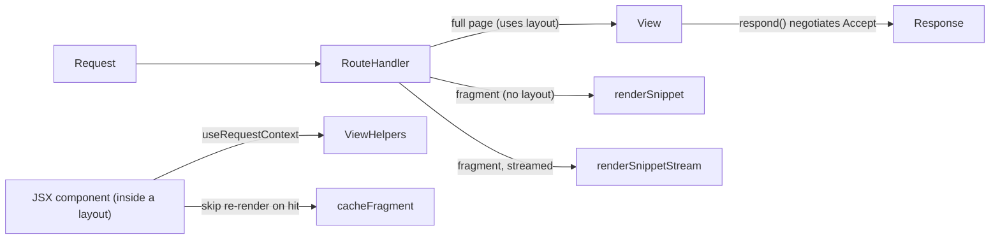

# View

## What / Why

`@tknf/oven/view` covers what happens after `RouteHandler` (see
[Getting started](./getting-started.md)) has matched a route and needs to
produce a `Response`. It's not one API but four small, independent pieces
that solve different rendering problems, all sharing the same backend-agnostic
principle (they only depend on `hono/jsx`, `Context`, and framework-internal
accessors — never on a specific frontend stack or platform binding):

- **`View`** — one class represents one resource, in as many wire formats
  (HTML/JSON/CSV/XML) as it implements; `respond` picks a format via
  `Accept` content negotiation.
- **`renderSnippet` / `renderSnippetStream`** — return a bare JSX fragment
  as a `Response`, without going through a layout. For partial-page
  updates (htmx, Turbo Frames/Streams).
- **`ViewHelpers`** — thin, no-argument accessors (`csrfToken`, `flash`,
  `currentUser`, `t`) callable from inside a JSX component via
  `useRequestContext()`, so cross-cutting concerns don't have to be
  threaded through every component's props.
- **`cacheFragment`** — caches a fragment's rendered HTML string so a
  repeat render can skip re-executing the JSX tree.

`LayoutComponent`/`LayoutProps` (the `jsxRenderer` component type and the
`c.render(...)` props type) are covered in
[Getting started § Rendering with a layout](./getting-started.md#rendering-with-a-layout) —
this guide assumes you already have a layout wired up and focuses on
everything that renders *within* it, or bypasses it entirely.



## Minimal example

A resource that renders as either HTML or JSON depending on the `Accept`
header:

```ts
// src/views/book_view.ts
import type { Context, Env } from "hono";
import { View } from "@tknf/oven/view";

export class BookView<E extends Env> extends View<E> {
  constructor(private readonly book: { id: string; title: string }) {
    super();
  }

  html(c: Context<E>) {
    return c.html(`<h1>${this.book.title}</h1>`);
  }

  json(c: Context<E>) {
    return c.json(this.book);
  }
}
```

```ts
// src/handlers/books_handler.ts
import { RouteHandler } from "@tknf/oven/routing";
import { BookView } from "../views/book_view.js";

export class BooksHandler extends RouteHandler {
  protected register() {
    this.get("/:id", (c) => new BookView({ id: c.req.param("id"), title: "..." }).respond(c));
  }
}
```

A request with `Accept: application/json` gets the JSON representation; any
other (or absent) `Accept` header falls back to the first implemented format
(`html`, by the base class's default ordering).

## Common tasks

### Serve HTML and JSON from one resource

Override only the format methods you need (`html`, `json`, `csv`, `xml`);
`View` detects which ones a subclass overrode (by comparing against
`View.prototype`) and only offers those to content negotiation — an
unimplemented format is never dispatched to. `respond` is the entry point
routes call; each format method can also be called directly (e.g.
`view.json(c)`) when a route always wants one specific format and
negotiation isn't needed.

### Add a frontend-specific content-type

The base class only knows the four backend-agnostic MIME types above.
To negotiate something frontend-specific, like Turbo Streams'
`text/vnd.turbo-stream.html`, override the protected `formats()` method and
prepend (or insert) your own `ViewFormat` entries — the array order is the
negotiation priority order, and `respond` picks the first entry whose
`contentTypes` intersects the `Accept` header:

```ts
import type { Context, Env } from "hono";
import { View, type ViewFormat } from "@tknf/oven/view";

class StreamableBookView<E extends Env> extends View<E> {
  html(c: Context<E>) {
    return c.html("<h1>...</h1>");
  }

  protected formats(): ViewFormat<E>[] {
    return [
      {
        name: "turboStream",
        contentTypes: ["text/vnd.turbo-stream.html"],
        handler: (c) =>
          c.body("<turbo-stream>...</turbo-stream>", 200, {
            "Content-Type": "text/vnd.turbo-stream.html; charset=UTF-8",
          }),
      },
      ...super.formats(),
    ];
  }
}
```

### Return a fragment for htmx/Turbo Frames

Use `renderSnippet` when a route should return a JSX fragment directly,
with no layout wrapping it:

```ts
import { renderSnippet } from "@tknf/oven/view";
import { jsx } from "hono/jsx";

this.get("/items/:id/edit-form", (c) =>
  renderSnippet(c, jsx("div", { id: "item" }, "..."))
);
```

Defaults to `text/html; charset=UTF-8`; pass `{ contentType: "..." }` to
override it (e.g. for a Turbo Stream fragment).

### Wire up `ViewHelpers` for csrfToken/flash/currentUser/t

`ViewHelpers` doesn't know how your app stores sessions or resolves the
current user — you pass in existing accessors, and it exposes them as
zero-argument functions callable from inside a JSX component:

```ts
// src/views/helpers.ts
import { ViewHelpers } from "@tknf/oven/view";
import { csrf } from "../security.js";
import { sessionAccessor } from "../session.js";
import { accountGuard } from "../auth.js";
import { t } from "../i18n.js";

export const helpers = new ViewHelpers({
  csrfToken: csrf.csrfToken,
  session: sessionAccessor.use,
  // `currentUser` must be a "safe" accessor that returns `undefined`
  // instead of throwing when unauthenticated — see Gotchas below.
  currentUser: (c) => {
    try {
      return accountGuard.use(c);
    } catch {
      return undefined;
    }
  },
  t,
});
```

Each helper must be called from within a component function, not inlined
directly into a `jsx(...)` call — see the streaming gotcha below for why.

```ts
const Form = () =>
  jsx("input", { type: "hidden", name: "_csrf", value: helpers.csrfToken() });
```

### Cache a fragment's rendered HTML

`cacheFragment` renders once, stores the resulting HTML string, and skips
re-rendering on a cache hit — minimal nested fragment caching:

```ts
import { cacheFragment } from "@tknf/oven/view";
import { jsx } from "hono/jsx";

const html = await cacheFragment(
  cache,
  `fragment:book-${book.id}-${book.updatedAt}`,
  { ttlSeconds: 60 },
  () => jsx("article", {}, book.title),
);
```

Invalidation is expressed by changing the key (e.g. including the record's
`updatedAt`) — there is no separate active-invalidation API beyond what the
underlying `Cache` already offers (TTL expiry, `Cache#forget`).

## Gotchas / Security notes

- **An unimplemented format throws, and is excluded from negotiation.**
  Calling `view.csv(c)` directly on a `View` that never overrode `csv`
  throws `"This view does not implement csv"`; going through `respond`
  instead returns `406` because `csv` was filtered out of `formats()`
  before content negotiation even ran.
- **`respond` returns `406`, not a default format, when nothing matches.**
  If `formats()` is empty, or the `Accept` header doesn't intersect any
  implemented format's `contentTypes`, `respond` throws an `HTTPException`
  with status `406` rather than silently guessing a representation.
- **`renderSnippetStream` is incompatible with automatic session commit.**
  Headers can't change once streaming has started, which is the same
  constraint `stream: true` responses have. Routes that stream must finish
  writing to the session *before* the streamed `element` starts evaluating.
- **`ViewHelpers.currentUser` must be a "safe" accessor.** The contract is
  that it returns `undefined` when unauthenticated, never throws. Pass a
  wrapped version of your Guard's `use` (see the example above), not the
  Guard accessor itself — `ViewHelpers` deliberately does not swallow
  exceptions on your behalf (an unrelated misconfiguration, like a session
  that was never registered, should still surface as a clear error instead
  of silently becoming "unauthenticated").
- **Every `ViewHelpers` accessor is optional, and calling an unwired one
  throws a clear "not wired up" message** naming the option you forgot to
  pass (e.g. `csrfToken is not wired up (pass csrfToken to the ViewHelpers
  constructor)`), rather than failing with a confusing `undefined is not a
  function`.
- **Delay evaluation inside a component function, not inline.** `jsx(...)`
  arguments are evaluated immediately, before `c.render(...)` runs, so
  calling a `ViewHelpers` accessor directly as a `jsx()` argument (instead
  of from within a function component) runs it outside the render context
  and throws `"RequestContext is not provided."` Wrap it in a small
  component function (`const Comp = () => jsx(...)`) so the call happens
  at render time.
- **Fragments containing `Suspense` or `useRequestContext` must never be
  passed to `cacheFragment`.** A `Suspense` boundary holds mid-streaming
  state that can't be stringified, and a fragment depending on
  `useRequestContext` (e.g. the current user) would leak one request's
  rendered HTML to a different user's response on a cache hit.
- **`cacheFragment`'s cached HTML is trusted, unescaped, on retrieval**
  (returned via `raw()`). This is safe only because the cached string was
  already escaped once by JSX at write time — never write a non-HTML or
  pre-unescaped string into the same cache key space, or it becomes an
  XSS sink.

## See also

- [Getting started](./getting-started.md) — `LayoutComponent`/`LayoutProps`
  and the `c.render(...)` wiring that `View`'s `html()` and JSX fragments
  render into.
- [Forms](./forms.md) — `FormView` builds on the same fragment-response
  idea for validation-error re-renders.
- [Sessions](./sessions.md) — the `SessionAccessor` that `ViewHelpers`'
  `flash` option delegates to.
- [Internationalization](./i18n.md) — the `Translator`/`t` that
  `ViewHelpers`' `t` option delegates to.
